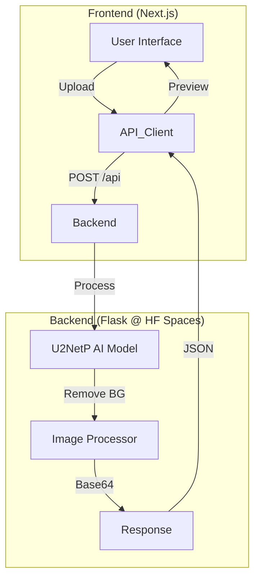

<div align="center">

# Novalens - AI Background Remover


[](CONTRIBUTING.md)

**A professional, AI-powered tool to remove image backgrounds in seconds.**
Built with **Next.js 15** (Frontend) and **Flask** (Backend) running on **Hugging Face Spaces**.

[🎥 Live Demo](https://yashnaiduu-novalens-backend.hf.space) · [🐛 Report Bug](https://github.com/yashnaiduu/Novalens/issues) · [✨ Request Feature](https://github.com/yashnaiduu/Novalens/issues)

</div>

---

## ✨ Features

- **🎯 Instant AI Removal**: Powered by `u2netp` (lightweight & fast) and `rembg`.
- **🎨 Smart Editor**: Drag & drop interface with Before/After comparison.
- **⚡ Super Fast**: Optimized with global session caching for <1s processing.
- **🔒 Secure & Private**: Images are processed in memory and never stored.
- **📱 Responsive UI**: Beautiful dark/light mode interface built with Tailwind CSS.

## 🏗️ Architecture



## 🚀 Quick Start

### Prerequisites

- Node.js 18+
- Python 3.11+

### Installation

1.  **Clone the repo**
    ```bash
    git clone https://github.com/yashnaiduu/Novalens.git
    cd Novalens
    ```

2.  **Backend Setup**
    ```bash
    python3 -m venv venv
    source venv/bin/activate
    pip install -r requirements.txt
    python3 app.py
    ```

3.  **Frontend Setup**
    ```bash
    cd next-frontend
    npm install
    npm run dev
    ```

4.  **Open App**
    Visit `http://localhost:3000`.

## 🤝 Contributing

We welcome contributions! Please see our [CONTRIBUTING.md](CONTRIBUTING.md) for details on how to get started.

## 📄 License

This project is licensed under the MIT License - see the [LICENSE](LICENSE) file for details.

---

<div align="center">
Made with ❤️ by Yash Naidu
</div>
