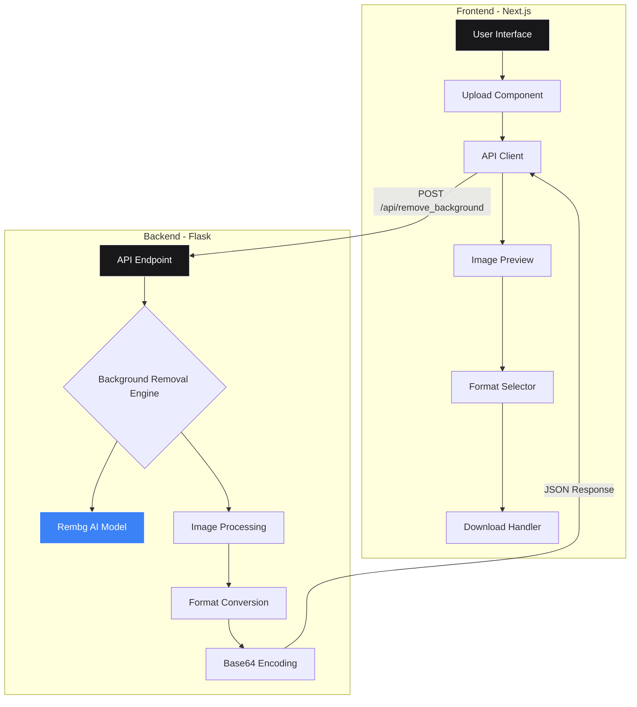

# Novalens - AI Background Remover

A free, fast, and powerful AI-powered background removal tool built with Next.js and Flask.

## Features

- **Instant Background Removal** - AI-powered background removal in seconds
- **Multiple Export Formats** - Download as PNG, JPG, or WEBP
- **100% Free** - No sign-up, no limits, completely free to use
- **Clean UI** - Minimalist, modern interface with dark mode support
- **Responsive Design** - Works perfectly on desktop and mobile

## Demo


*Watch the app in action: upload images, remove backgrounds instantly, and download in your preferred format*

## Project Architecture



### Tech Stack

**Frontend:**
- Next.js 15 (React 19)
- TypeScript
- Tailwind CSS
- Framer Motion
- Lucide Icons

**Backend:**
- Flask (Python)
- Rembg (AI Background Removal)
- Pillow (Image Processing)
- ONNX Runtime

## Quick Start

### Prerequisites

- Node.js 18+ and npm
- Python 3.11+
- pip

### Installation

1. **Clone the repository**
   ```bash
   git clone https://github.com/yashnaiduu/background-remover-pro.git
   cd background-remover-pro
   ```

2. **Install Frontend Dependencies**
   ```bash
   cd next-frontend
   npm install
   ```

3. **Install Backend Dependencies**
   ```bash
   cd ..
   pip3 install flask flask-cors flask-sqlalchemy flask-mail python-dotenv pillow PyJWT
   pip3 install "rembg[cpu]"
   ```

### Running Locally

1. **Start the Backend Server** (Terminal 1)
   ```bash
   python3 app.py
   ```
   Backend will run on `http://localhost:8000`

2. **Start the Frontend Server** (Terminal 2)
   ```bash
   cd next-frontend
   npm run dev
   ```
   Frontend will run on `http://localhost:3000`

3. **Open your browser** and navigate to `http://localhost:3000`

## Project Structure

```
background-remover-pro/
├── next-frontend/          # Next.js frontend application
│   ├── src/
│   │   ├── app/           # App router pages
│   │   ├── components/    # React components
│   │   ├── lib/          # API client & utilities
│   │   └── providers/    # Context providers
│   └── public/           # Static assets
├── app.py                # Flask backend server
├── models.py            # Database models
└── README.md            # This file
```

## Usage

1. **Upload an Image** - Click or drag & drop an image (PNG, JPG, WEBP)
2. **Wait for Processing** - AI removes the background automatically
3. **Choose Format** - Select PNG, JPG, or WEBP
4. **Download** - Get your processed image instantly

## Configuration

### Backend Port
Edit `app.py` line 375:
```python
port = int(os.environ.get('PORT', 8000))  # Change 8000 to your preferred port
```

### Frontend API URL
Create `next-frontend/.env.local`:
```env
NEXT_PUBLIC_API_BASE=http://localhost:8000
```

## License

MIT License - feel free to use this project for personal or commercial purposes.

## Contributing

Contributions are welcome! Feel free to open issues or submit pull requests.

## Author

**Yash Naidu**
- GitHub: [@yashnaiduu](https://github.com/yashnaiduu)

---

Made with ❤️ using Next.js and Flask
