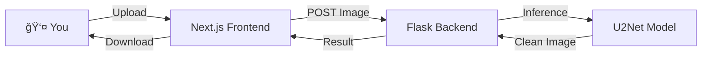

<div align="center">

# 💎 Novalens
### The Intelligent Background Remover


[](https://yashnaiduu-novalens-backend.hf.space)

<br/>

**Give your images the focus they deserve.**
Novalens isn't just a tool; it's the easiest way to make your subjects pop. Powered by advanced AI, it strips away clutter in seconds, leaving you with pixel-perfect transparency.

[**Launch Live Demo**](https://yashnaiduu-novalens-backend.hf.space) · [Request Feature](https://github.com/yashnaiduu/Novalens/issues) · [Report Bug](https://github.com/yashnaiduu/Novalens/issues)

</div>

---

## ✨ Why Novalens?

We built Novalens because we believe professional editing shouldn't require a degree. Whether you're a designer, developer, or just someone who loves clean photos, we've got you covered.

- **🎨 Artistic Precision**: Our AI (`u2netp`) understands edges, ensuring hair and fur details aren't lost.
- **⚡ Blazing Fast**: Engineered for speed. Drop an image, blink, and it's done.
- **🔒 Private by Design**: Your images are processed in-memory and vanish instantly. We never store your data.
- **📱 Beautiful Everywhere**: A responsive, dark-mode-first interface that feels right on any device.

---

## 📸 See the Magic


*Upload, Process, Download. It's that simple.*

---

## 🛠️ Under the Hood

For the developers who love to know how things work:

### 🌟 Frontend
Built with **Next.js 15** and **TypeScript**. We use **Tailwind CSS** for that sleek look and **Framer Motion** for buttery smooth interactions.

### 🧠 Backend
A robust **Flask** API powered by **ONNX Runtime**. We use the `rembg` library with a global session strategy to ensure the AI model is always warm and ready for your requests.

### ☁️ Deployment
Dockerized and hosted on **Hugging Face Spaces**, giving us the power of cloud-grade inference without the complexity.




---

## 🚀 Get Started

Want to run this locally? Fantastic! Here is how you can set up your own instance.

### Prerequisites
- **Node.js** (v18+)
- **Python** (v3.11+)

### 1. Clone & Prepare
```bash
git clone https://github.com/yashnaiduu/Novalens.git
cd Novalens
```

### 2. Ignition (Backend)
```bash
python3 -m venv venv
source venv/bin/activate
pip install -r requirements.txt
python3 app.py
```
*Your backend is now humming at `http://localhost:8000`*

### 3. Liftoff (Frontend)
```bash
cd next-frontend
npm install
npm run dev
```
*Your frontend is now live at `http://localhost:3000`*

---

## ☁️ One-Click Deploy

Want your own private version? Deploy entirely to Hugging Face Spaces with a single click.

[](https://huggingface.co/new-space?template=yashnaiduu/Novalens)

---

## 🤝 Join the Community

We love open source. If you have an idea, a fix, or just want to say hi, check out our [CONTRIBUTING.md](CONTRIBUTING.md).

**Found a bug?** Open an [Issue](https://github.com/yashnaiduu/Novalens/issues).
**Liked the project?** Give us a ⭐️ on GitHub!

---

<div align="center">

**Made with 💙 by Yash Naidu**

[GitHub](https://github.com/yashnaiduu) · [Twitter](https://twitter.com/yourhandle)

</div>
